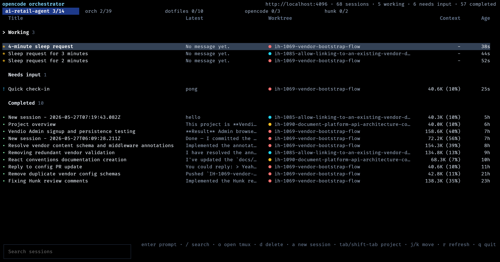

# orch

Terminal orchestrator for [opencode](https://opencode.ai/) with native git worktree and tmux support.



`orch` connects to an opencode persistence server, shows recent unarchived sessions, groups them by project, and lets you jump back into the right tmux workspace. It is built with Bun, React 19, and OpenTUI.

## Features

- Live terminal UI for active opencode sessions, refreshed every 2 seconds.
- Project tabs with per-worktree session rows.
- Lanes for `Working`, `Needs input`, and `Completed` sessions.
- Latest assistant-message preview and context-window usage per session.
- Fuzzy search across session titles and worktree names.
- Prompt an existing session or create a new session from the dashboard.
- Delete sessions with confirmation.
- Open the selected project/worktree in tmux, reusing matching sessions when possible.

## Requirements

- [Bun](https://bun.sh/) 1.3 or newer.
- A running opencode persistence server. By default, `orch` connects to `http://localhost:4096`.
- `tmux` for the `o` shortcut that opens the selected worktree.

## Installation

Clone the repo and install dependencies:

```bash
git clone https://github.com/princejoogie/orch.git
cd orch
bun install
```

Run from source:

```bash
bun run dev
```

Build a standalone Bun executable for your current platform:

```bash
bun run build
./dist/orch
```

The build output is `dist/orch` on macOS/Linux and `dist/orch.exe` on Windows.

## Usage

Start the dashboard:

```bash
orch
```

If your opencode server is not running on the default port, set `OPENCODE_SERVER_URL`:

```bash
OPENCODE_SERVER_URL=http://localhost:4096 orch
```

CLI flags:

```bash
orch --help
orch --version
```

## Keybindings

| Key | Action |
| --- | --- |
| `j`, `Down` | Move selection down |
| `k`, `Up` | Move selection up |
| `g`, `g` | Jump to top |
| `G` | Jump to bottom |
| `Tab` | Next project tab |
| `Shift+Tab` | Previous project tab |
| `/` | Focus search |
| `Enter` | Prompt the selected session |
| `a` | Create a new session in the active project |
| `o` | Open the selected worktree in tmux |
| `d` | Delete the selected session |
| `r` | Refresh sessions |
| `` ` `` | Toggle the OpenTUI console |
| `q`, `Esc`, `Ctrl+C` | Quit |

Prompt dialogs submit with `Enter`; use `Shift+Enter` for a newline.

## How It Works

`orch` talks to opencode through `@opencode-ai/sdk`. It lists recent unarchived global sessions from the last 24 hours, loads session statuses, and enriches visible rows with latest messages and context usage.

When opening a session in tmux, `orch` derives a session name from the project or git worktree, reuses an existing tmux session when it can, and focuses an existing `opencode` pane if one is already running.

## Development

Common commands:

```bash
bun run dev
bun run typecheck
bun run lint
bun run format:check
bun run build
```

Benchmark opencode snapshot polling:

```bash
bun run bench:opencode
bun run bench:opencode -- --iterations=50 --limit=300 --server=http://localhost:4096
```

## Project Structure

- `src/index.ts` - CLI entry point and flags.
- `src/tui.tsx` - OpenTUI React application and keyboard workflow.
- `src/opencode/` - opencode SDK client, session discovery, and row shaping.
- `src/tmux.ts` - tmux session discovery, creation, attach, and pane focusing.
- `scripts/build.ts` - Bun executable build script.

## License

No license file is currently included.
